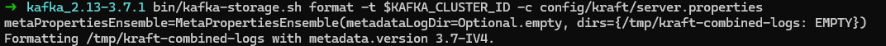
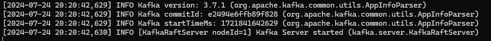

# Домашнее задание №2

## 1. Запустить Kafka с Kraft
* Сгенерируем идентификатор кластера

  
* Форматируем папки для журналов

  
* Запускаем брокер

  
  
  После выполнения команды брокер запускается:
  

## 2. Настроить аутентификацию SASL/PLAIN. Создать трёх пользователей с произвольными именами.

Для включения SASL/PLAIN небходимо добавить соответствующие настройки в конфигурацию брокера: 
```properties
listeners=BROKER://:9092,CONTROLLER://:9093
inter.broker.listener.name=BROKER
advertised.listeners=BROKER://localhost:9092
controller.listener.names=CONTROLLER
listener.security.protocol.map=CONTROLLER:SASL_PLAINTEXT,BROKER:SASL_PLAINTEXT

sasl.enabled.mechanisms=PLAIN
sasl.mechanism.controller.protocol=PLAIN
sasl.mechanism.inter.broker.protocol=PLAIN

listener.name.broker.plain.sasl.jaas.config=org.apache.kafka.common.security.plain.PlainLoginModule required \
    username="admin" \
    password="admin-password" \
    user_admin="admin-password" \
    user_Bob="Bob-password" \
    user_Mike="Mike-password" \
    user_Bill="Bill-password";

listener.name.controller.plain.sasl.jaas.config=org.apache.kafka.common.security.plain.PlainLoginModule required \
    username="admin" \
    password="admin-password" \
    user_admin="admin-password" \
    user_Bob="Bob-password" \
    user_Mike="Mike-password" \
    user_Bill="Bill-password";

### ACL ###
authorizer.class.name=org.apache.kafka.metadata.authorizer.StandardAuthorizer
allow.everyone.if.no.acl.found=true
super.users=User:admin
```

Основным пользователем для брокера является admin с паролем admin-password. Так же были явно заданы 3 других пользователя:
- Bob
- Mike
- Bill

Для каждого из пользователей создадим соответствующие properties файлы для аутентификации со следующим содержанием:
```properties
security.protocol=SASL_PLAINTEXT
sasl.mechanism=PLAIN
sasl.jaas.config=org.apache.kafka.common.security.plain.PlainLoginModule \
	required username="Bob" password="Bob-password";
```

Соответственно у каждого пользователя должны быть соответствующие им username и password.

После внесения изменений запустим брокер с новым конфигурационным файлом:

```shell
bin/kafka-server-start.sh config/kraft/server-sasl.properties
```
## 3. Настроить авторизацию. Создать топик. Первому пользователю выдать права на запись в этот топик. Второму пользователю выдать права на чтение этого топика. Третьему пользователю не выдавать никаких прав на этот топик.
 * Проверяем механизм аутентификации
   * Попробуем создать топик не указывая файл для аутентификации
     ```shell
      bin/kafka-topics.sh --create --topic test --bootstrap-server localhost:9092
     ```
     получаем ошибку:
   
     

   * Попробуем создать топик указав файл для аутентификации
   
     ```shell
      bin/kafka-topics.sh --create --topic test --bootstrap-server localhost:9092 --command-config config/client/admin.properties
     ```
     Топик упешно создается:
 
     
   * Пользователям назначим права на топик test:
     - Bob - запись
     - Mike - чтение
     - Bill - отсутствуют права

     

## 4. От имени каждого пользователя выполнить команды:
  * Получить список топиков

    

  * Записать сообщения в топик

    

  * Прочитать сообщения из топика

    