## Домашнее задание №6. Развернуть Kafka Connect, настроить интеграцию с postgreSQL используя Debezium PostgreSQL CDC Source Connector

1. Описание конфигурации сервисов в docker-compose.yml:
      - Zookeeper
      - Кластер из 3 брокеров Kafka
      - Kafka Connect
      - База данных Postgresql
+ Zookeeper:
   ```yaml
  zookeeper:
  image: confluentinc/cp-zookeeper:latest
  container_name: zookeeper
  hostname: zookeeper
  ports:
      - "2181:2181"
  environment:
  ZOOKEEPER_CLIENT_PORT: 2181
  ZOOKEEPER_TICK_TIME: 2000
  ```
+ Kafka:
    ```yaml
    kafka1:
        image: confluentinc/cp-kafka:latest
        container_name: kafka1
        hostname: kafka1
        ports:
          - "9092:9092"
        environment:
          KAFKA_BROKER_ID: 1
          KAFKA_ZOOKEEPER_CONNECT: zookeeper:2181
          KAFKA_ADVERTISED_LISTENERS: LISTENER_DOCKER_INTERNAL://kafka1:19092,LISTENER_DOCKER_EXTERNAL://${DOCKER_HOST_IP:-127.0.0.1}:9092
          KAFKA_LISTENER_SECURITY_PROTOCOL_MAP: LISTENER_DOCKER_INTERNAL:PLAINTEXT,LISTENER_DOCKER_EXTERNAL:PLAINTEXT
          KAFKA_INTER_BROKER_LISTENER_NAME: LISTENER_DOCKER_INTERNAL
          KAFKA_LOG4J_ROOT_LOGLEVEL: INFO
          KAFKA_CONFLUENT_SUPPORT_METRICS_ENABLE: "false"
        depends_on:
          - zookeeper
    ```
+ Kafka Connect:
    ```yaml
    connect:
        image: confluentinc/cp-kafka-connect:latest
        container_name: connect
        hostname: connect
        depends_on:
          - zookeeper
          - kafka1
          - kafka2
          - kafka3
        ports:
          - 8083:8083
        environment:
          CONNECT_BOOTSTRAP_SERVERS: "kafka1:19092,kafka2:19093,kafka3:19094"
          CONNECT_REST_PORT: "8083"
          CONNECT_GROUP_ID: "local-connect"
          CONNECT_CONFIG_STORAGE_TOPIC: "local-connect-config"
          CONNECT_OFFSET_STORAGE_TOPIC: "local-connect-offsets"
          CONNECT_STATUS_STORAGE_TOPIC: "local-connect-status"
          CONNECT_KEY_CONVERTER: "org.apache.kafka.connect.json.JsonConverter"
          CONNECT_VALUE_CONVERTER: "org.apache.kafka.connect.json.JsonConverter"
          CONNECT_REST_ADVERTISED_HOST_NAME: "connect"
          CONNECT_LOG4J_ROOT_LOGLEVEL: "INFO"
          CONNECT_PLUGIN_PATH: /usr/share/java/,/etc/kafka-connect/jars
        volumes:
          - ./connect:/etc/kafka-connect/jars
    ```
  В качестве внешнего раздела подключается директория, содержащая необходимые jar файлы для работы плагина
  Debezium PostgreSQL CDC Source Connector

+ Postgresql
  ```yaml
  postgres:
  image: postgres:latest
  container_name: postgres
  hostname: postgres
  ports:
  - "5432:5432"
  environment:
  POSTGRES_PASSWORD: password
  volumes:
  - ./postgres/custom-config.conf:/etc/postgresql/postgresql.conf
  command: postgres -c config_file=/etc/postgresql/postgresql.conf
  ```
  В качестве внешнего раздела подключается кофигурационный файл со следующими настройками:
  ```properties
  listen_addresses = '*'
  wal_level = 'logical'
  max_wal_senders = 1
  max_replication_slots = 1
  ```

2. Запускаем Kafka, Kafka Connect и Postgres:
    ```shell
   docker compose up -d
    ```
   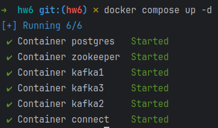

    Проверяем стартовали ли сервисы:
    ```shell
    docker compose ps -a
    ```
   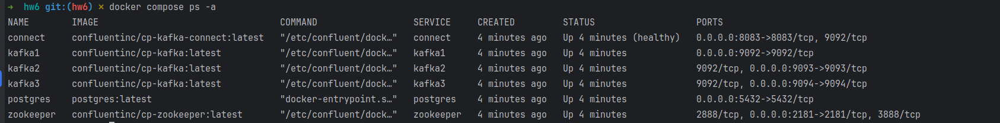

3. Проверям логи Kafka Connect:
    ```shell
   docker logs -f connect
   ```
   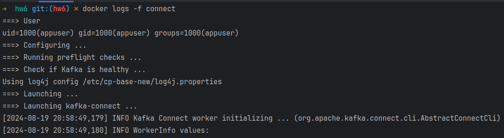
4. Проверяем статус и плагины коннекторов
    ```shell
    curl http://localhost:8083 | jq
    ```
   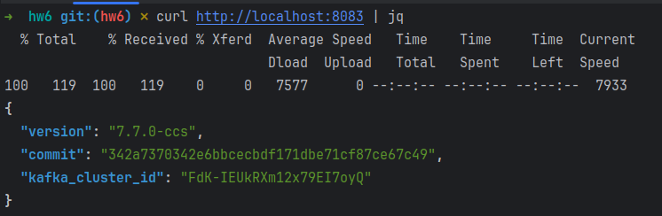
    ```shell
    curl http://localhost:8083/connector-plugins | jq
    ```
    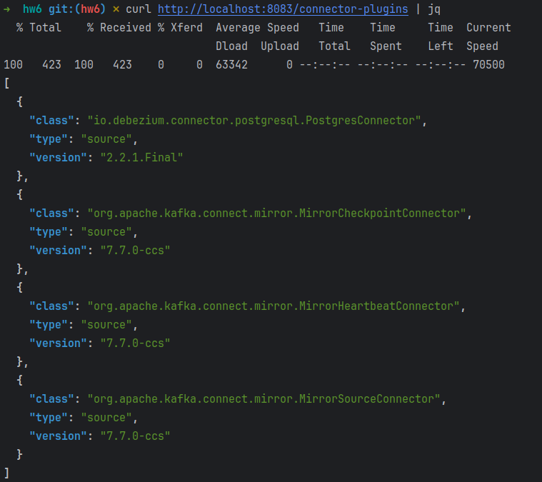
5. Проверяем список топиков
    ```shell
    docker exec kafka1 kafka-topics --list --bootstrap-server kafka1:19092,kafka2:19093,kafka3:19094
    ```
   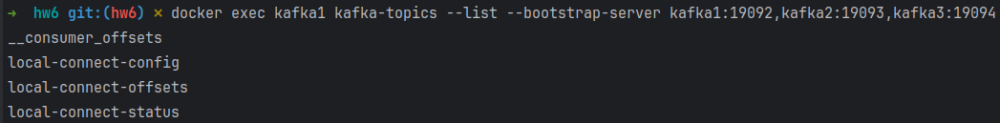
6. Создадим таблицу в PostgreSQL и запишем в неё данные
    ```shell
    docker exec -ti postgres psql -U postgres
    CREATE TABLE customers (id INT PRIMARY KEY, name TEXT, age INT);
    INSERT INTO customers (id, name, age) VALUES (5, 'Fred', 34);
    INSERT INTO customers (id, name, age) VALUES (7, 'Sue', 25);
    INSERT INTO customers (id, name, age) VALUES (2, 'Bill', 51);
    SELECT * FROM customers;
    \q
    ```
   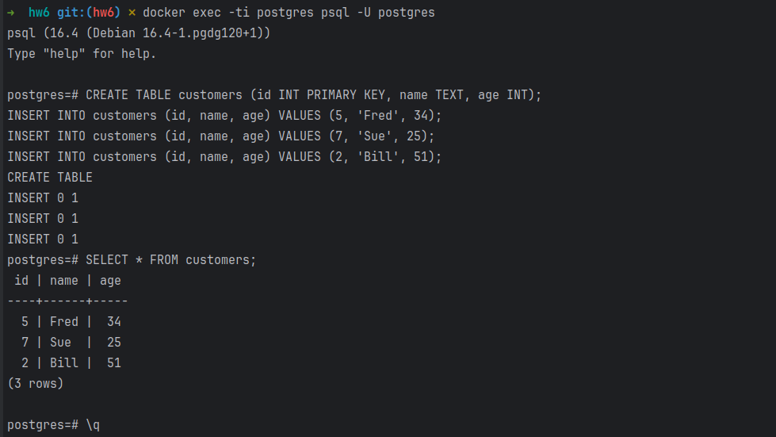
7. Создаём коннектор customers-connector
    ```shell
    curl -X POST --data-binary "@customers.json" -H "Content-Type: application/json" http://localhost:8083/connectors | jq
    ```
   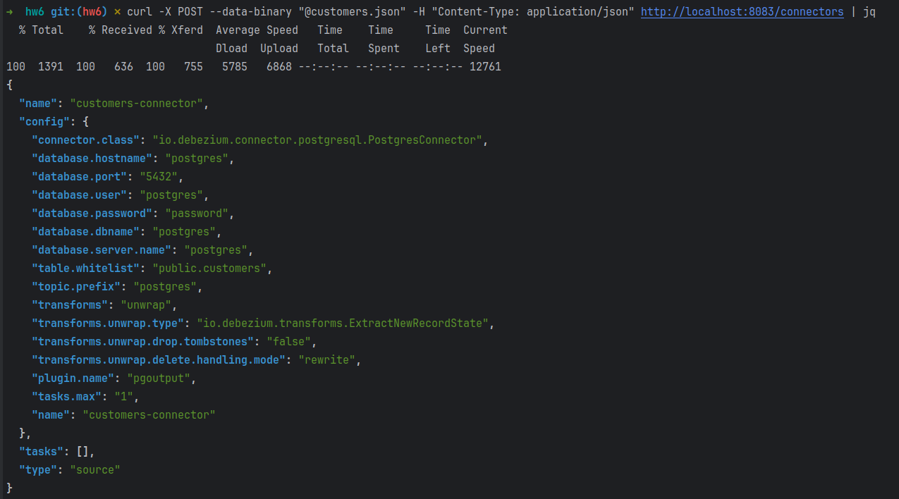
8. Проверяем коннектор customers-connector
    ```shell
    curl http://localhost:8083/connectors | jq
    curl http://localhost:8083/connectors/customers-connector/status | jq
    ```
   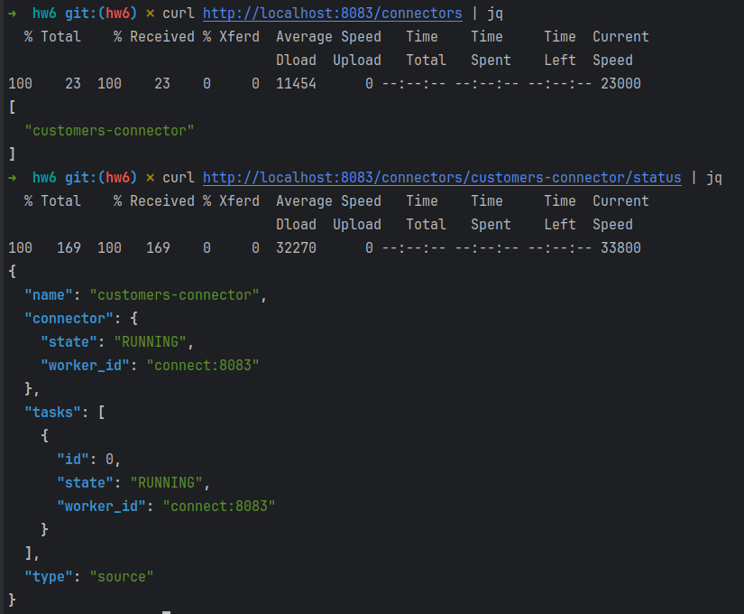
9. Проверяем топики
    ```shell
    docker exec kafka1 kafka-topics --list --bootstrap-server kafka1:19092,kafka2:19093,kafka3:19094
    ```
   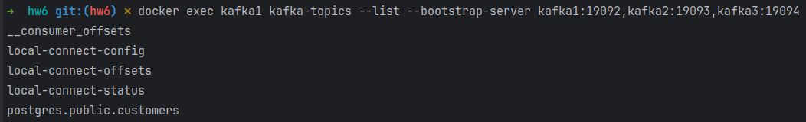
10. Читаем топик postgres.public.customers
    ```shell
    docker exec kafka1 kafka-console-consumer --topic postgres.public.customers --bootstrap-server kafka1:19092,kafka2:19093,kafka3:19094 --property print.offset=true --property print.key=true --from-beginning
    ```
    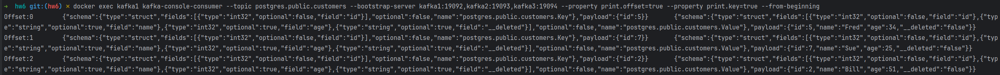
11. Открываем второй терминал, обновляем записи в таблице
    ```shell
    docker exec -ti postgres psql -U postgres
    INSERT INTO customers (id, name, age) VALUES (3, 'Ann', 18);
    UPDATE customers set age = 35 WHERE id = 5;
    DELETE FROM customers WHERE id = 2;
    \q
    ```
    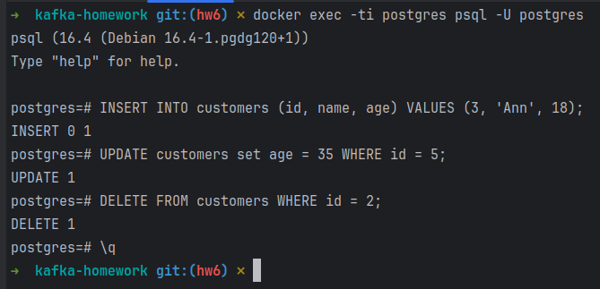
    
    После чего в топик приходят сообщения:
    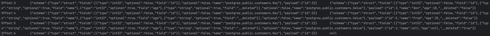
